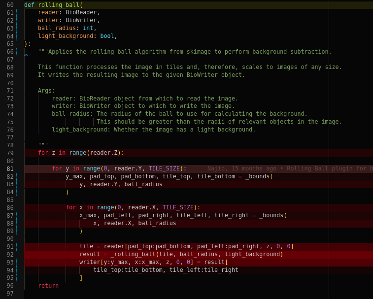

# python-line-profiler (v0.0.1)

`python-line-profiler` is a vscode extension to configure and run [line_profiler](https://github.com/pyutils/line_profiler#installation), then visualize the results in the editor.

## Contents

1. [Features](#features)
2. [Installation and Requirements](#installation-and-requirements)
3. [Extension Settings](#extension-settings)
3. [Known Issues](#known-issues)
4. [Donate](#funding)

## Features

To use `python-line-profiler`:
1. Select a function or functions to profile
2. Select a script to use for profiling
3. Run the script
4. Review the results that use inline profiling, with tooltips providing exact times

In the above example, line 92 is the brightest and therefore the most time consuming line of code.

A test script can be used to profile the code if it uses `unittest`.

## Installation and Requirements

This extension requires that Python 3.7+ is installed. It is recommended that the vscode Python extension (ms-python) is installed.

## Extension Settings

Currently no custom settings are supported, but this should change in the future.

## Known Issues

This is a very buggy beta. There are probably a lot of issues. Known issues are:
1. Registering multiple functions with the same name with only show visualizations on one of the functions
2. Registering multiple scripts will cause the function profile to be overwritten if a registered function occurs in both scripts.
3. Visualizations only appear on changing tabs.
4. `pytest` files cannot be used as test scripts.
5. No other testing packages can be used either.

Possible issues based on the current code:
1. Renamed imports (`import numpy as np`) could cause issues.
2. Relative imports with more than one level of namespace packages will likely cause problems.

## Release Notes

This is a buggy beta. If you're trying it out, give us some feedback in the [issues](https://github.com/PerpetualHelp/python-line-profiler/issues)!

## Funding

Donations are appreciated to support the continued development of this project and future projects like it.

